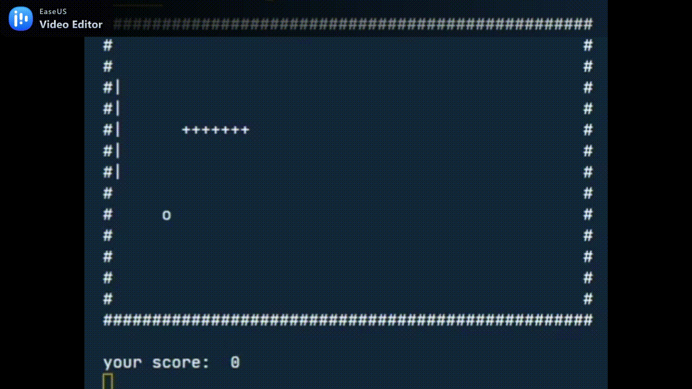

# snakepong AKA snaka69

## Intro

Deze game werd gemaakt door Jens Cocquyt en Arthur Coupé. Snakepong is namelijk opgebouwd uit twee games. Snake waarbij de speler een ster op een omrand vlak bestuurt. Terwijl het vooruit beweegt, laat het een spoor achter dat lijkt op een bewegende slang.
En pong, de game pong is een tweedimensionaal sportspel dat tafeltennis simuleert waarbij je jouw tegenstander moet verslaan. Als je deze twee spellen combineert krijg je dan snakepong, bij snakepong is het de bedoeling punten te scoren in andermans doel maar de computer heeft een pedal waardoor het weel eens moeilijk kan worden om te scoren. De gameplay is als volgt. Wanneer de bal de linkermuur raakt krijg je een punt, wanneer de snake de muur raakt is het gameover en wannneer de bal de rechtermuur raakt is het ook gameover. Hieronder een voorbeeld van de game.



## Installation

Eerst moeten we pynput globaal installeren, dit doen we door de command "pip install pynput" uit te voeren.

```
pip3 install pynput
```

Voor de game uit te voeren:
```
python gameLoop.py
```


## Requirements

__Taak requirements__
1. Maak een analyse van het probleem, bedenk welke componenten je allemaal nodig hebt en beschrijf dit in een README.md. Hierbij verwacht ik ook een schema van de code.

2. Deel de code op in de functionele game logic en de weergave. Je mag de weergave beperken tot een print in de console. Je hoeft het spel niet real-time kunnen spelen.

3. Voorzie testen voor de game logic. Je hoeft niet alles te testen.

__Game requirements__
==Finished== | ==Exercise== | ==Difficulty==
:---: | ---- | ----
 ✔️ | Walls | :star:
 ✔️ | Snake Head | :star:
 ✔️ | Movement | :star: :star::star:
 ✔️ | Snake Tail | :star::star:
 ✔️ | Pong balkje | :star::star:
 ✔️ | Score | :star:
 ✔️ | Ball | :star::star::star:
 ✔️ | Tests | :star::star:
 ✔️ | Colissions | :star::star::star:

 ## Stappenplan
 ### Stap 1: Playfield en Game
 __Voor de eerste stap hebben we gekozen voor het playfield te kunnen tekenen.__
 * Canvas.py
    * Hierin wordt de game getekend, met "#" als border.
 * GameLoop.py
    * In gameloop gaan we onze keys gaan intialiseren met pynput. Pynput zorgt ervoor wanneer dat we een key gaan indrukken dat onze snake kan bewegen. Ook werd er in dit bstand de gameloop aangemaakt, deze gaat hele tijd loopen todat je verliest. Dit is dus het hart van de code, vanuit hieruit wordt alles aangestuurt.

 ### Stap 2: Snake

 __Voor de tweede stap hebben we gekozen voor de game snake volledig functioneel te maken.__
 * Snake.py
    * Hierin wordt onze snake getekend met de bijkomende tails. Ook wordt de snake hier functioneel gemaakt zodat deze kan bewegen naar links, rechts, boven en onder. Als laatste hebben we dan snake collision toegevoegd, dit zodat wanneer de snake tegen de border van het canvas (muren) of tegen zijn eigen tail je een gameover krijgt.
    
 ### Stap 2: Pong

 __Voor de tweede stap hebben voor het stukje pong gekozen, hierin wordt dan een automatische op en neergaande balk geinplementeerd die de bal weerkaasts.__
 * Ball.py
    *  In onze ball.py wordt onze bal aangemaakt, deze beweegt over het speelveld naar alle kanten en kan bestuurd worden door te botsen met de snake. In de bal.py werden collisions toegevoegd met de muren, de pedal en de snake.
 * Pedal.py
    * In de pedal.py wordt de pedal aangemaakt die links over het veld heen en weer beweegt. De pedal heeft als bedoeling de bal terug te kaatsen, dit werd mogelijk gemaakt aan de hand van de collisions.

## schema

Hieronder vindt u het schema van onze game, hoe de werking in elkaar zit.

